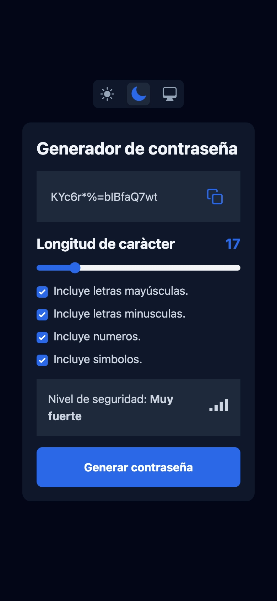
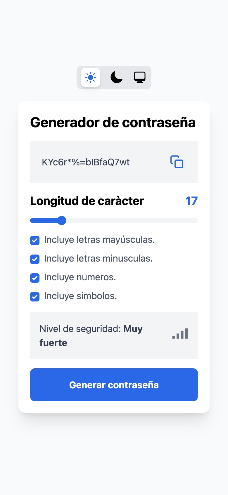
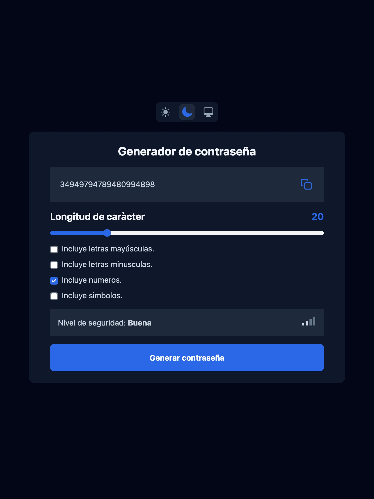
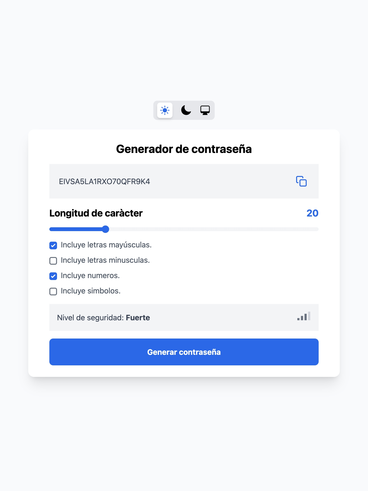
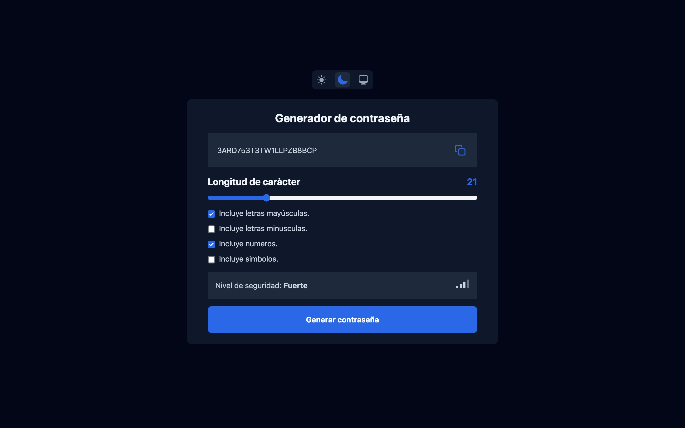
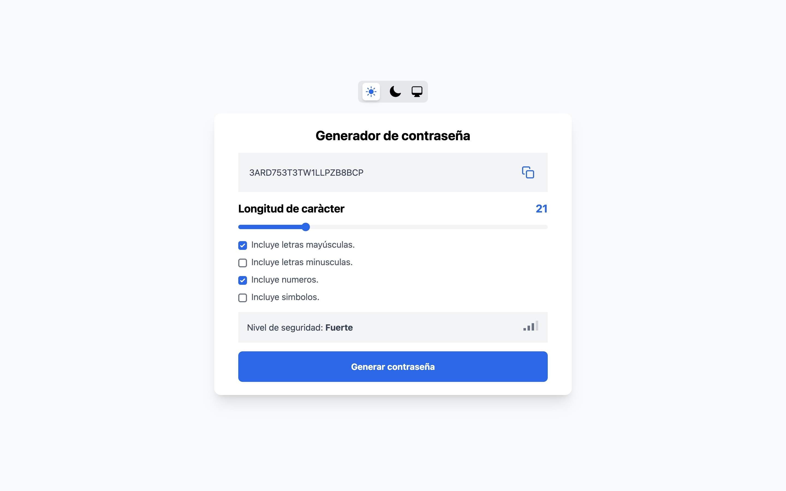

# Pasword Generator


## Introducción

Password Generator como su nombre lo dice es un generador de contraseñas el cual te generara una contraseña aleatoria en base a algunas opciones que se le pasen las cuales son la longitud de la contraseña (cuantos caracteres quieres que tenga tu contraseña), incluir mayusculas, incluir minúsculas, incluir números y incluir símbolos.

Una vez generada la contraseña puedes copiarla al portapapeles al hacerlo saldrá un pequeño mensaje indicando que ya se copio.

Podrás observar que tan fuerte es tu contraseña con unas lineas de progreso y un mensaje los posibles mensajes son: 

- **Muy débil:** Este mensaje saldrá para una contraseña sin ninguna linea de progreso. 

- **Débil:** Este mensaje saldrá para contraseña con una linea de progreso.

- **Buena:** Este mensaje saldrá para una contraseña con dos lineas de progreso.

- **Fuerte:** Este mensaje saldrá para una contraseña con tres lienas de progreso.

- **Muy fuerte:** Este mensaje saldrá para una contraseña con 4 lineas de progreso.

También como extra se agrego el poder seleccionar un tema **Dark**, **Light** o puedes seleccionar el de tu sistema operativo.

## Stack
- React con ViteJs + TypeScript + SWC
- Tailwindcss
- Zustand

## Instalación

1. Descarga o clona el repositorio.
2. Navega en tu terminal a la carpeta del proyecto.
3. Instala los módulos de Node

>``` 
>npm install
>```

4. Al terminar de instalar los módulos de Node ejecuta el siguiente comando para poder probar:

>```
>npm run dev
>```

5. Te dejo el link para que puedas probar un Demo: [https://fernandocm18.github.io/password-generator/](https://fernandocm18.github.io/password-generator/)

## Capturas
### Mobile





### Tablet





### Desktop




